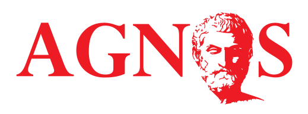

There is a large number of UI frameworks that can be used for web app development. Without too much effort, You can add UI elements by just incorporate the the markup language provided by any of those frameworks. The markup is however framework specific, and causes a vendor lock-in.

### Concept

The example below shows the differences between the usage of a large colorful button in bootstrap and Bulma.

```html
<button class="btn btn-primary btn-lg">botstrap button</button>
```

```html
<button class="button is-primary is-large">bulma button</button>
```

In order to be able to move from one UI framework to another, we introduce a clean and standard markup for the html (we're not religious about this markup, but we aim to be as close to html5 standard as we can).

```html
<button class="large">agnos button</button>
```

In our scss file, we're using the agnos to transform the underlying UI framework to our UI.

There are couple of other related concerns that are related to this work:

-   (web) components have an encapsulated view and therefor require smaller (dedicated) pieces of CSS. Agnos should be able to provide access to a small portion of the UI library only.
-   similar to CSS, icons are another candidate to be replaced. This can be done in the same spirit, but requires another technique.
-   variables (i.e. colors) are framework specific as well, we're considering to make those more generic (and move to css variables while we do that)
-   similar to icons and variables, the font settings should be configurable in a generic way. We haven't deep dived here, but this seems straightforward for now.

### Getting started

Agnus has not yet been published to npm. In order to experiment with this framework, you can clone the project and use it by adding the following lines to your application scss file:

```
@import '../../agnos/scss/bulma';
@include _bootstrap($button: true, $tabs: true);
```

(this example will extend bulma, but only the button and tabs).

### Coverage

This library just got started, so only a few components have been transformed. The implementation is intended to be extendable, but in order to 'proof' the concept, the following UI frameworks are used:

-   [Bootstrap](https://getbootstrap.com/)
-   [Materialize](https://materializecss.com/)
-   [Foundation sites](https://foundation.zurb.com/sites.html)
-   [Bulma](https://bulma.io)
-   [Fundamental UI](https://sap.github.io/fundamental/)

| Feature        | Bootstrap | Materialize | Bulma | Foundation | Fundamental UI |
| -------------- | --------- | ----------- | ----- | ---------- | -------------- |
| **Typography** | ✅        | ✅          | ✅    | ✅         | ✅             |
| **Button**     | ✅        | ✅          | ✅    | ✅         | ✅             |
| **Tabs**       | ✅        | ✅ &sup1;   | ✅    | ✅         | ✅             |
| **Alert**      | ✅        | N/A         | ✅    | ✅         | ✅             |

&sup1; Feature is incomplete as it requires JS

### Limitations

This project only tries to fix the CSS part of the UI. Any interaction that requires JS are out of scope (which btw causes another dependency lock-in).

The key technique that used in agnos relies on inheritance, a key concept form the sass language. Using sass `@extend` obviously requires the UI framework to support sass in the first place (but most of them seem to do that). Ideally, UI frameworks would offer placeholder selectors to extend from,instead of concrete selectors. This would decrease the CSS output. Without placeholder selectors, the output is more poluted then anyone would like.
